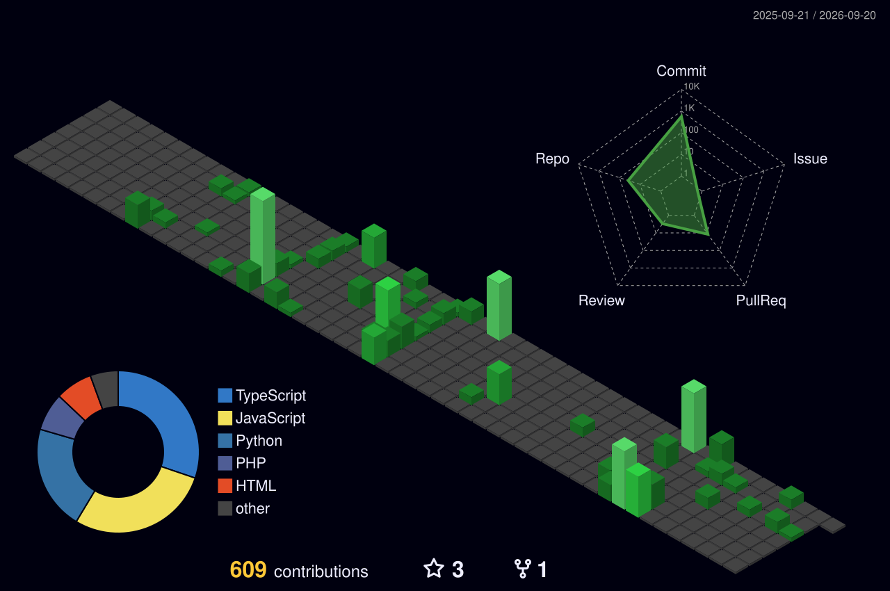

<!-- Header Section with Typing Animation -->

  

<h3 align="center">Crafting smart solutions through Hardware & AI ⚡</h3>

  
  
  

---

### 👨‍💻 About Me

- 🔭 I’m currently a **Mentor & Mentee at RACE SVCE** and exploring advanced **Embedded Systems, IoT & AI**.
- 🌱 I’ve previously interned at **Hyundai Motor India Ltd.** and the **TANSAM Center of Excellence** focusing on Design for Manufacturing, IoT, and Embedded Systems.
- ⚙️ I love working on **Hardware, Robotics, AI integration, and Smart IoT solutions**.
- 💬 Ask me about **Microcontrollers, PCB Design, IoT architecture, and AI models for hardware**.
- 📫 Reach out to me via my [Portfolio](https://lohithashwa.me) or [LinkedIn](https://www.linkedin.com/in/lohith-ashwa-s-480842277/).

---

### 🚀 Featured Projects

| Project | Description |
| ------- | ----------- |
| 🛡️ **Smart Tourist Safety System** | AI-powered safety system using geo-fencing and blockchain-based digital ID for incident detection and emergency coordination. |
| 🤖 **Automatic Agricultural Bot** | Smart farming robot automating irrigation, fertilization, pest detection, and plant health monitoring via AI and sensors. |
| 🌬️ **Tunnel Booster Fan Control** | Safety system monitoring air quality and operating আকাশে remove toxic gases. |
| 🌿 **AI Remote Plant Monitoring** | Advanced system using AI to detect diseases, nutrient deficiencies, and pests in crops remotely. |
| 💧 **RO Water Re-mineralization** | Reintroduces essential minerals into RO-purified water using controlled dosing and water quality sensors. |
| 🫀 **Fetal Health Monitoring** | Healthcare IoT device monitoring fetal heart rate and maternal health parameters for safe pregnancy outcomes. |

---

### 🛠️ Tech Stack & Tools

  <!-- Customize these icons based on your exact stack using skillicons.dev -->
  

---

### 📊 GitHub Stats

  

 

  

 

  

---

### 🐍 Contribution Snake Animation

  <picture>
    <source media="(prefers-color-scheme: dark)" srcset="https://raw.githubusercontent.com/lohithashwas/lohithashwas/output/github-contribution-grid-snake-dark.svg?v=1">
    <source media="(prefers-color-scheme: light)" srcset="https://raw.githubusercontent.com/lohithashwas/lohithashwas/output/github-contribution-grid-snake.svg?v=1">
    
  </picture>

---

### 🧊 3D Contribution Graph

  

---

  

